# **Who Do I Talk To?**

## Using Natural Language Processing to Recommend Therapists

#### For a live demo of the recommender [click here](http://ec2-18-216-146-179.us-east-2.compute.amazonaws.com:8105/).

**Table of Contents**

[TOC]

## The Problem: 

People often are confused about how to choose a therapist. The best resource for a recommendation tends to be from a trusted family or friend. However, that is often not available or the person doesn't feel comfortable letting others know they are seeking therapy. So where to go? 

The most popular place is probably an on-line therapist directory such as those found at PsychologyToday.com and GoodTherapy.com.  Searching for a therapist in a directory can be overwhelming as there are a lot of terms and jargon a person will encounter. 

When I was in practice, I heard over any over again from my clients about how difficult and confusing it was to find a therapist. A key aspect of the confusion was the amount of jargon they encountered on the directories.

Some examples of jargon one might run into:

- Dialectical Behavioral Therapy
- Accelerated Experiential Dynamic Psychotherapy
- Psychotherapy vs Counselor vs Coaching
- PhD vs PsyD vs LMFT vs LPC vs MSW

Plus there are so many options. According to the United States Department of Labor's Bureau of Labor Statistics, there are over **552,000 mental health professionals** practicing in the U.S. today whose main focus is the treatment (and/or diagnosis) of mental health or substance abuse concerns.

In **Denver**, there are **1,912 therapists** listed on PsychologyToday.com's therapist directory

### The Goal: 

- To simplify!
- Let the person tell their story and recommend therapists based on this.
- Use Natural Language Processing and Topic Modeling to find latent topics on which to match client to therapist.
  - Based on the theory that how people write is reflective of how they think and communicate. So matching people with similar writing profiles may lead to a better therapeutic fit.

## The Data

I obtained profile data for **4062** therapists in the Denver Metro Area from **GoodTherapy.com**. Each profile contains a section where the therapist can describe their approach and their practice. This is the section is outlined in red below and is the focus for this project.

### Sample Profile

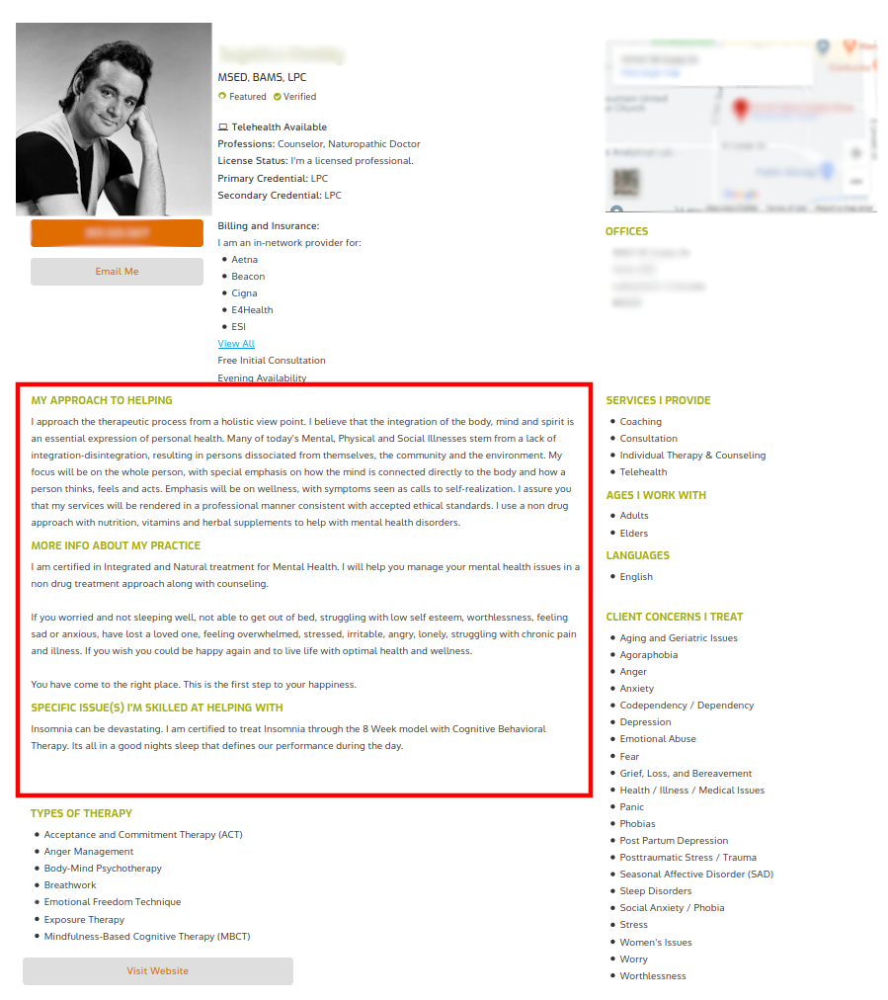

### Data Fields

Almost all of the data is categorical, many of which were lists containing various misspellings and redundant entries, so required extensive cleaning.

The primary field for analysis is **writing_sample**, which is main body of text in the profile.

| field                        | data-type | sample entries                                               |
| ---------------------------- | --------- | ------------------------------------------------------------ |
| name                         | string    | Peter                                                        |
| address                      | string    | Venkman                                                      |
| phone                        | string    | 212.555.1234                                                 |
| license status               | string    | Active                                                       |
| primary_credential           | string    | Clinical Psychologist                                        |
| website                      | string    | www.mytherapypractice.com                                    |
| therapy_types **(list)**     | strings   | Acceptance and Commitment Therapy (ACT), Attachment-Based Family Therapy (ABFT), Body-Mind Psychotherapy, Existential Psychotherapy, Eye Movement Desensitization and Reprocessing Therapy (EMDR), Holistic Psychotherapy, Mindfulness-Based Interventions |
| issues_treated **(list)**    | strings   | Codependency / Dependency, Communication Problems, Control Issues, Depression, Dissociation, Emotional Abuse, Emotional Overwhelm, Emptiness, Family of Origin, Issues, Family, Problems, Grief, Loss and Bereavement |
| services_provided **(list)** | strings   | Clinical Supervision, Coaching Consultation, Individual Therapy & Counseling, Telehealth |
| age_groups **(list)**        | strings   | Teens, Adults                                                |
| professions **(list)**       | strings   | Counselor, Mental Health Counselor, Licensed Clinical Psychologist |
| license_verified             | boolean   | True                                                         |
| writing_sample               | text      | I want to hear from you what your struggles and concerns are, what you  feel you need, what you want your life to be and what you find  challenges you from having the life you most want. Life can be  overwhelming... |

### Technologies Used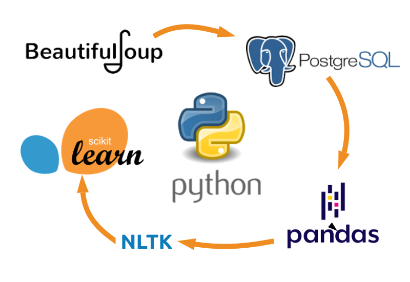

### Database Design

PostgreSQL is "a general purpose and object-relational database management system, the most advanced open source database system" that implement structures query language (SQL).  PostgreSQL was developed in the Berkeley Computer Science Department at the University of California.

The database design was based of data available on GoodTherapy.org and PsychologyToday.com. Both had very similar data with some different naming conventions. 

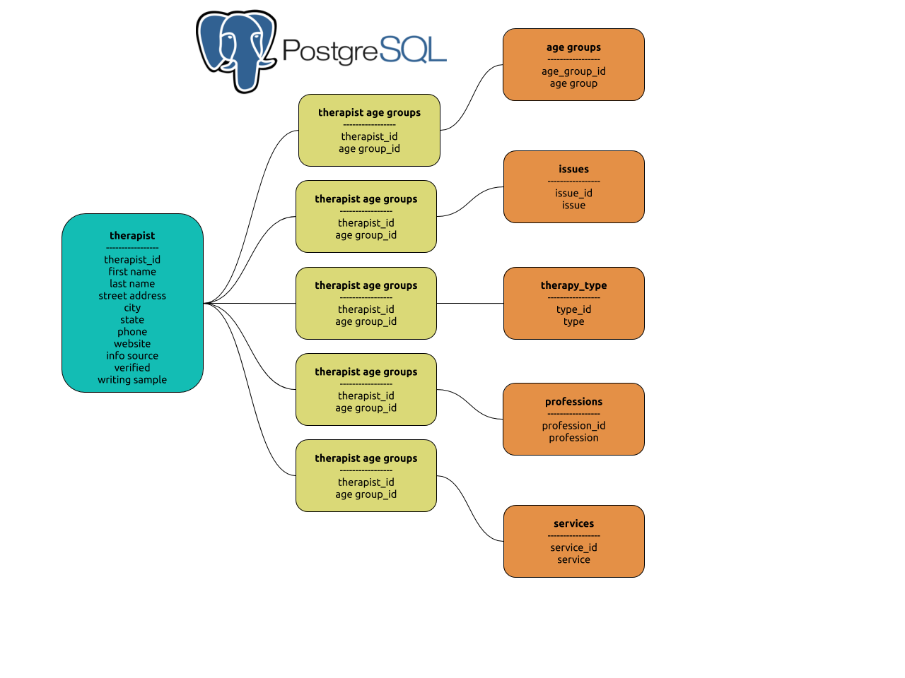

## EDA

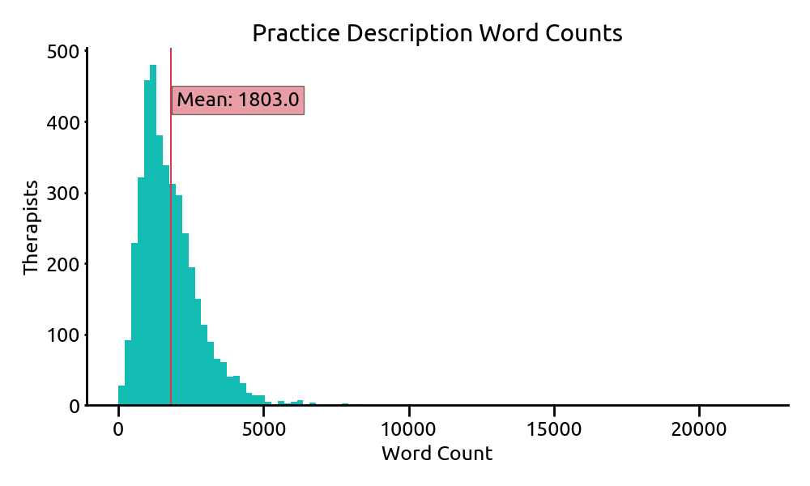

Most therapists use about 1900 words to describe their approach and practice.

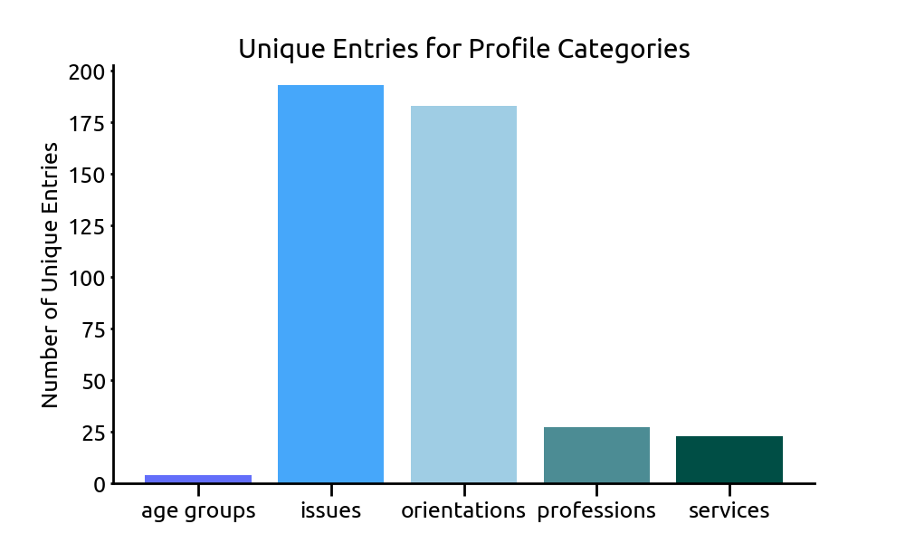

In addition to the practice description area, each profile contains several lists containing different information about the therapist's practice. Here we see that there are far more possible options for issues and therapy types and accordingly, these are the categories that have the most entries on therapist profiles. Issues and orientations are also the categories that contain the most jargon, thus highlighting how they could contribute to confusion and feel overwhelming to a client.

### N-Grams

Since I will be using a bag-of-word method to analyze the data, and thus loose the contextual information for each word, I decided to explore the use of bi-grams (two-word combinations) and tri-grams (three-word combinations). As this charts show, some context can be retained with bi-grams and tri-grams. I ultimately decide to use bi-grams for the model in order to capture some of the context since so many terms in psychology are dependent on their neighbors for their meaning.

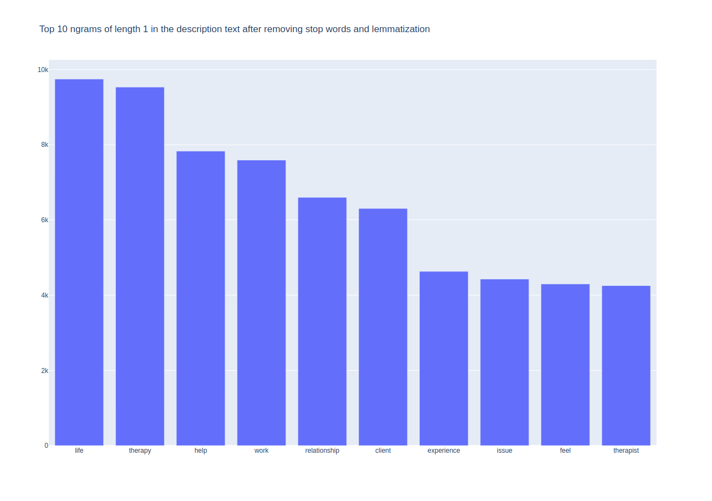

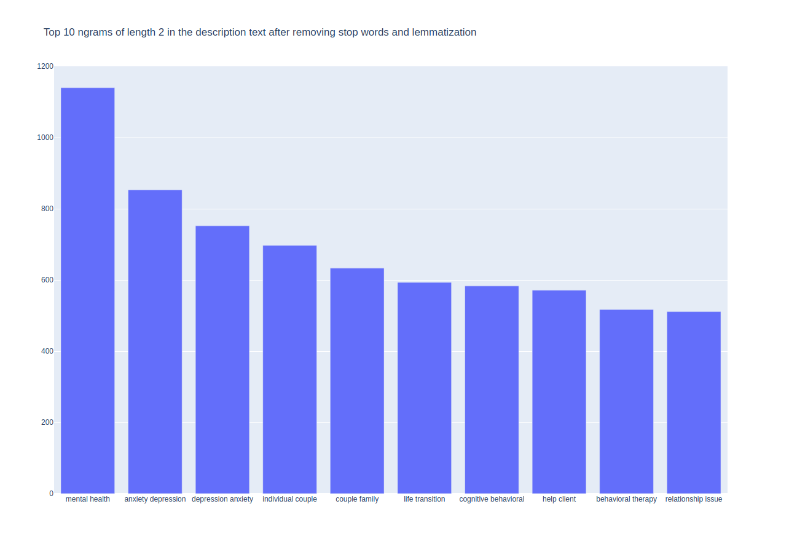

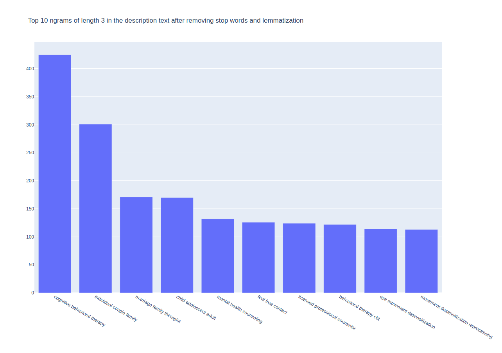

### Looking for Structure with Principal Component Analysis

#### PCA With Term-Frequency/Inverse Document Frequency (TF-TIDF) Matrix

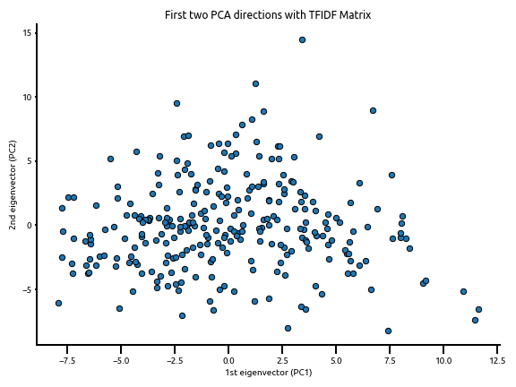

#### PCA With Term-Frequency (TF) Matrix

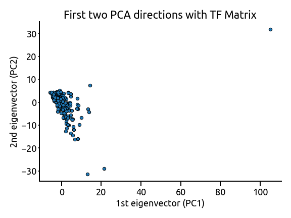

The PCA analysis confirms adequate structure within the data. We can also see that the TF-IDF provides greater structure and may be preferred for topic modeling over the TF.

While have over 200 topics to reach 90% cumulative variance explained would be ideal, for the purposes of this project I have chosen a smaller number of topics.

## Topic Modeling

### Workflow

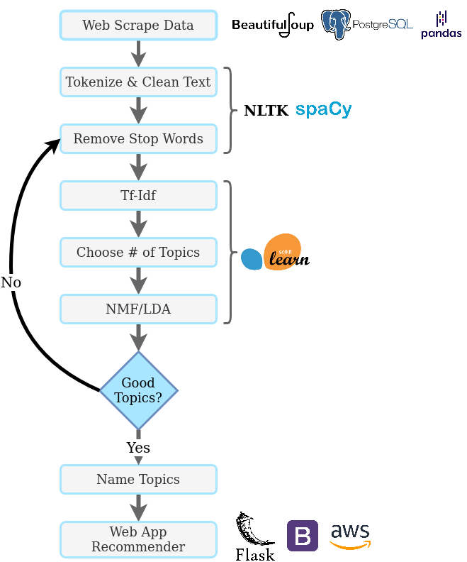

### Latent Dirichlet Allocation Model (LDA)

I first tried the Latent Dirichlet Allocation Model. I used pyLDAvis to visualize different numbers of topics ranging from 3 to 20. The best separation based on intertopic distance came at 4-5 topics, yet I did not find that the topic words grouped into understandable groups at that number. Unfortunately, due to time constraints I was unable to tweak the alpha and beta prior coefficients as much as I'd have liked.

[**Perplexity**](https://en.wikipedia.org/wiki/Perplexity) is a statistical measure of how well a probability model predicts a sample. Lower is better, though perplexity is not strongly correlated with human judgment, so these numbers should be not be given too much weight.

### Model perplexity: 878.052

#### Top Words for 5 Topics from LDA

### Non Negative Matrix Factorization (NMF)

I also wanted to see what kind of topics NMF would produce using a similar text processing pipeline. I did a check on the reconstruction error for number of topics up to 50 to see if that would provide some insight into the best number of topics to use. 

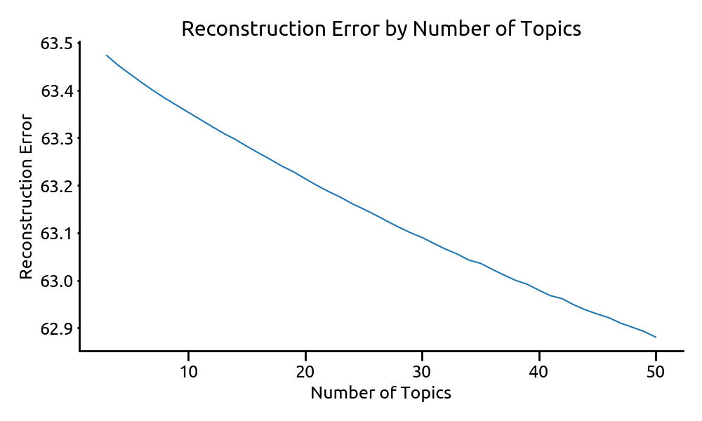

As can be seen from the chart above, as well as considering the PCA scree plot from earlier, the ideal number of topics would be quite a large number. After many trials evaluating topic words using my domain expertise in the field of clinical psychology, I decided that 15 topics would be adequate to capture enough signal to produce good recommendation results. 

#### Top Words for 5 Topics from NMF

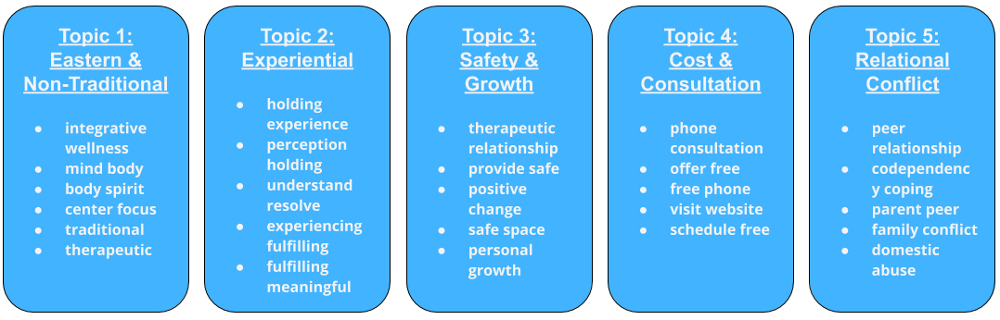

## The Recommender

Ultimately, I chose the NMF model for the recommender as it produced more interpretable topics with words that clustered together with clearer connections. Perhaps more stop word changes and adjustment of the alpha and beta prior coefficients would lead to LDA having preferable topics, but given the quality of the NMF results with minimal stop word manipulation it made the most sense to me to use NMF.

Recommender Model Fit and Transformed with Therapist data --> new user text submitted --> new data fit to NMF model and produces loadings for each topic found within the text --> additional topic weightings applied --> cosine similarity of topic loading vectors with each therapist --> return therapist with the highest cosine similarity

The recommender takes a new text submission from a person seeking therapy and fits their text to the existing model. I then use cosine similarity to compare the person's writing to all of the therapists in the geographic region specified by the user and return the therapists with the highest similarity score.

I built a Flask Web App to demonstrate the recommender in action. It can be found here:

**[Find Your Fit - An NLP-Based Therapist Recommender](http://ec2-18-216-146-179.us-east-2.compute.amazonaws.com:8105/)**

## Conclusions

In conclusion, I believe this demonstrates that using natural language processing to find important themes within client and therapists writing can be a powerful tool in finding a good therapeutic fit, without the need for the client to understand jargon or the therapist to have to worry about explaining jargon.

There are some clear limitations to this project. Two primary limitations are therapist writing sample was not provided with this use-case in mind, so the actual writing sample may be different when provided with this recommender in mind. Also, with my dataset, there is no way of knowing if the writing sample was actually written by the therapist.

If this were to be put into production, new writing samples would need to be collected.

