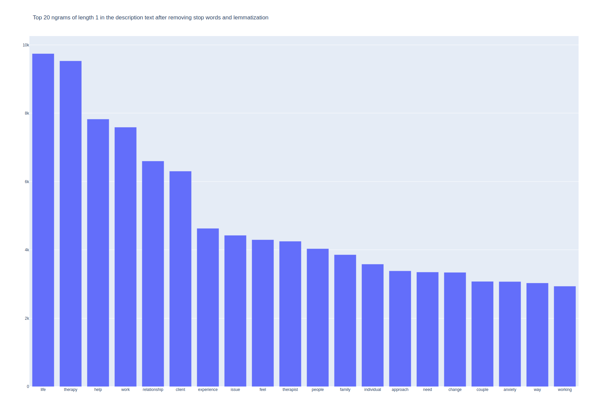
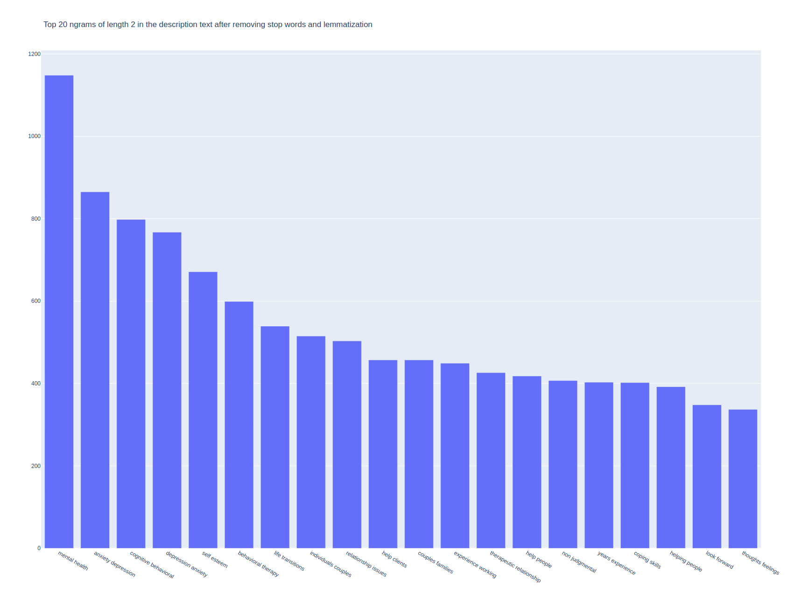
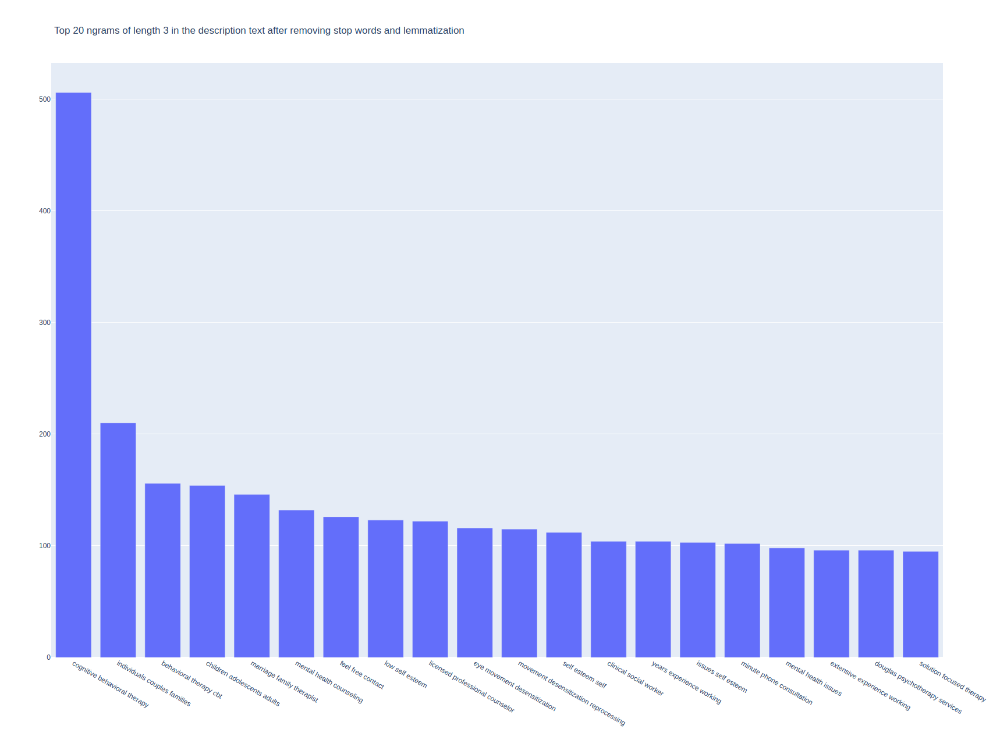
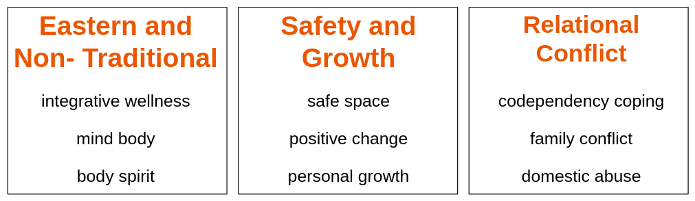

# **Who Do I Talk To?**

## Using Natural Language Processing to Recommend Therapists

## 5/10/202 - Please note this document is a work in progress. Please check back soon if you'd like to see an updated version

## The Problem: 

People often are confused about how to choose a therapist. The best resource for a recommendation tends to be from a trusted family or friend. However, that is often not available or the person doesn't feel comfortable letting others know they are seeking therapy. So where to go? 

The most popular place is probably an on-line therapist directory such as those found at PsychologyToday.com and GoodTherapy.com.  Searching for a therapist in a directory can be overwhelming as there are a lot of terms and jargon a person will encounter. 

Some examples of jargon one might run into:

- Dialectical Behavioral Therapy
- Accelerated Experiential Dynamic Psychotherapy
- Psychotherapy vs Counselor vs Coaching
- PhD vs PsyD vs LMFT vs LPC vs MSW

Plus there are so many options. According to the United States Department of Labor's Bureau of Labor Statistics, there are over **552,000 mental health professionals** practicing in the U.S. today whose main focus is the treatment (and/or diagnosis) of mental health or substance abuse concerns.

In **Denver**, there are **1,912 therapists** listed on PsychologyToday.com's therapist directory

### The Goal: 

- To simplify!
- Let the person tell their story and recommend therapists based on this.
- Use Natural Language Processing and Topic Modeling to find latent topics on which to match client to therapist.
  - Based on the theory that how people write is reflective of how they think and communicate. So matching people with similar writing profiles may lead to a better therapeutic fit.

## The Data

I obtained profile data for **4062** therapists in the Denver Metro Area from **GoodTherapy.com**. 

### Sample Profile

### Data Fields

Almost all of the data is categorical, many of which were lists.

The primary field for analysis is **writing_sample**, which is main body of text in the profile.

| field                        | data-type | sample entries                                               |
| ---------------------------- | --------- | ------------------------------------------------------------ |
| name                         | string    | Peter                                                        |
| address                      | string    | Venkman                                                      |
| phone                        | string    | 212.555.1234                                                 |
| license status               | string    | Active                                                       |
| primary_credential           | string    | Clinical Psychologist                                        |
| website                      | string    | www.mytherapypractice.com                                    |
| therapy_types **(list)**     | strings   | Acceptance and Commitment Therapy (ACT), Attachment-Based Family Therapy (ABFT), Body-Mind Psychotherapy, Existential Psychotherapy, Eye Movement Desensitization and Reprocessing Therapy (EMDR), Holistic Psychotherapy, Mindfulness-Based Interventions |
| issues_treated **(list)**    | strings   | Codependency / Dependency, Communication Problems, Control Issues, Depression, Dissociation, Emotional Abuse, Emotional Overwhelm, Emptiness, Family of Origin, Issues, Family, Problems, Grief, Loss and Bereavement |
| services_provided **(list)** | strings   | Clinical Supervision, Coaching Consultation, Individual Therapy & Counseling, Telehealth |
| age_groups **(list)**        | strings   | Teens, Adults                                                |
| professions **(list)**       | strings   | Counselor, Mental Health Counselor, Licensed Clinical Psychologist |
| license_verified             | boolean   | True                                                         |
| writing_sample               | text      | I want to hear from you what your struggles and concerns are, what you  feel you need, what you want your life to be and what you find  challenges you from having the life you most want. Life can be  overwhelming... |

R

### Work-flow

### Database Design

PostgreSQL is "a general purpose and object-relational database management system, the most advanced open source database system" that implement structures query language (SQL).  PostgreSQL was developed in the Berkeley Computer Science Department at the University of California.

The database design was based of data available on GoodTherapy.org and PsychologyToday.com. Both had very similar data with some different naming conventions. 

## Here's some sparse EDA to accompany the sparse matrices later on...

###### Most people seem to use about 2000 words in their profile.

###### Here we see that there are far more possible options for issues and therapy types and accordingly, these are the categories that have the most entries on therapist profiles. Might this be unhelpful to potential clients in that it could be overwhelming to understand what so many terms mean?

### N-Grams

Since I will be using a bag-of-word method to analyze the data, and thus loose the contextual information for each word, I decided to explore the use of bi-grams (two-word combinations) and tri-grams (three-word combinations). As this charts show, some context can be retained with bi-grams and tri-grams. I ultimately decide to use bi-grams for the model in order to capture some of the context since so many terms in psychology are dependent on their neighbors for their meaning.

## Looking for Structure with Principal Component Analysis

#### PCA With TFIDF Matrix

###### Here we confirm that there is adequate structure within the data to warrant topic modeling.

##### While have over 200 topics to reach 90% cumulative variance explained would be ideal, for the purposes of this project I have chosen a smaller number of topics.

## Latent Dirichlet Allocation Model (LDA)

I first tried the Latent Dirichlet Allocation Model which produced the following results:

[**Perplexity**](https://en.wikipedia.org/wiki/Perplexity) is a statistical measure of how well a probability model predicts a sample. Lower is better.

##### Model perplexity: 878.052

Despite having quite a high perplexity score, some interesting topics emerged.

### Top Words for 3 Topics from LDA

#### Topic: Adult Relationships, Couples

##### Top words

- experience,
- place
- love
- often
- safe

#### Topic: Mind-Body/Somatic

##### Top words

- body
- wellbeing
- philosophy
- towards
- mind

#### Topic: Family and Children

##### Top words

- client
- family
- office
- child
- adult

## Non Negative Matrix Factorization (NMF)

I also wanted to see what kind of topics NMF would produce using a similar text processing pipeline.

Again, we see that a large number of topics would be ideas for this model, however after much testing and due to time and resource constraints, I decided that 15 topics would be adequate to capture enough signal to produce good recommendation results. I based this off of my domain expertise in the field of clinical psychology.

### Top Words for 3 Topics from NMF

NMF Ended up producing much better topics than LDA, as the words clustered within topics strongly and were clearly different from the top words of other topics. Therefore I chose NMF for my final recommender model.

## The Recommender

The recommender takes a new text submission from a person seeking therapy and fits their text to the existing model. I then use cosine similarity to compare the person's writing to all of the therapists in the geographic region specified by the user and return the therapists with the highest similarity score.

I built a Flask Web App to demonstrate the recommender in action. It can be found here:

[Find Your Fit - An NLP-Based Therapist Recommender](http://ec2-18-216-146-179.us-east-2.compute.amazonaws.com:8105/)

## Conclusions

In conclusion, I believe this demonstrates that using natural language processing to find important themes within client and therapists writing can be a powerful tool in finding a good therapeutic fit, without the need for the client to understand jargon or the therapist to have to worry about explaining jargon.

There are some clear limitations to this project. Two primary limitations are therapist writing sample was not provided with this use-case in mind, so the actual writing sample may be different when provided with this recommender in mind. Also, with my dataset, there is no way of knowing if the writing sample was actually written by the therapist.

If this were to be put into production, new writing samples would need to be collected.

