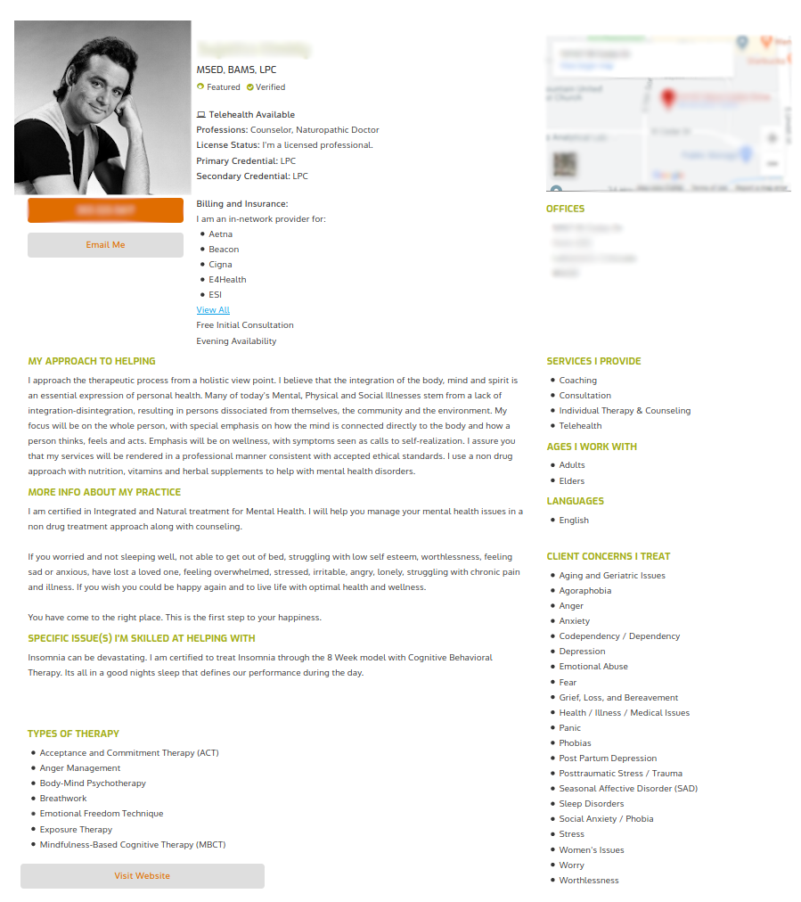
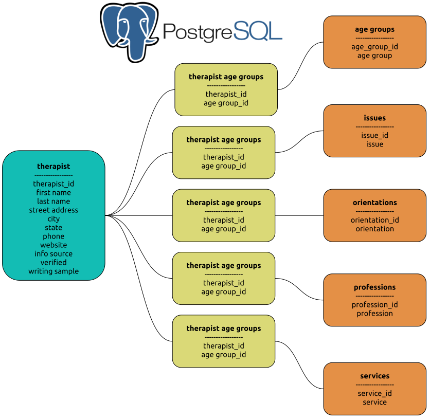
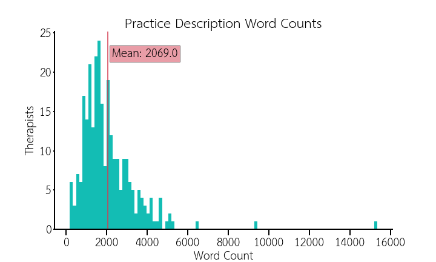
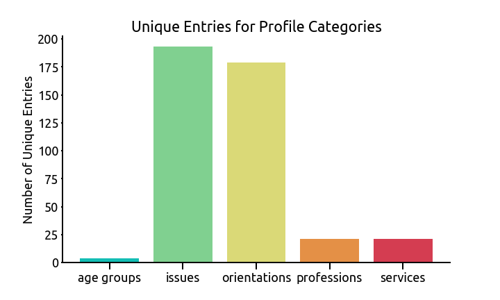

# NLP Analysis of Therapists' Writing

## The Problem: 

People often are confused about how to choose a therapist. The best resource for a recommendation tends to be from a trusted family or friend. However, that is often not available or the person doesn't feel comfortable letting others know they are seeking therapy. So where to go? 

The most popular place is probably an on-line therapist directory such as those found at PsychologyToday.com and GoodTherapy.com.  **Searching for a therapist in a directory can be overwhelming as there are a lot of terms and jargon a person will encounter.**  Raise your hand if you know what Dialectical Behavioral Therapy is and if it would help you.

Plus there are so many options. According to the United States Department of Labor's Bureau of Labor Statistics, there are over **552,000 mental health professionals** practicing in the U.S. today whose main focus is the treatment (and/or diagnosis) of mental health or substance abuse concerns.

In **Denver**, there are **1,912 therapists** listed on PsychologyToday.com's therapist directory

### The Ultimate Goal: 

Create a machine learning model that matches a client to a therapist based on NLP analysis of a writing sample from each party.

### Capstone 1 Goals:

- Create a dataset of therapist writing samples from therapist profiles found from publicly available data on GoodTherapy.com
- Perform topic modeling on writing samples of Greater Denver Area therapists to see what themes cluster therapists together base on what words they use to describe their practice.
- Therapists often group around their **therapeutic orientation**, which is the primary psychological theory that guides their work. I will explore how the topics generates align with the traditional orientations.

## The Data

I obtained profile data for 273 therapists from GoodTherapy.com. 

### Sample Profile

##### Data Fields

Almost all of the data is categorical, many of which were lists.

| strings                  | text                 | boolean          | int  |
| ------------------------ | -------------------- | ---------------- | ---- |
| name                     | practice description | license verified |      |
| address                  |                      |                  |      |
| phone                    |                      |                  |      |
| license status           |                      |                  |      |
| primary credential       |                      |                  |      |
| website                  |                      |                  |      |
| types of therapy (list)  |                      |                  |      |
| issues treated (list)    |                      |                  |      |
| services provided (list) |                      |                  |      |
| age groups (list)        |                      |                  |      |
| professions (list)       |                      |                  |      |

### More on why it is hard to pick a therapist

Usually 

### Workflow

Scrape -> Postgres -> Pandas -> NLTK processing -> SKLearn Analysis (LDA)  - maybe spaCy also

### Database Design

PostgreSQL is "a general purpose and object-relational database management system, the most advanced open source database system" that implement structures query language (SQL).  PostgreSQL was developed in the Berkeley Computer Science Department at the University of California.

Created database after designating the key data available on GoodTherapy.org and PsychologyToday.com. Both had very similar data with some different naming conventions. Certain features (issues, specialties, communities, groups, modalities, services) had several spelling variations on values so I reviewed these features and consolidated them to eliminate/reduce redundancy. I also engineered a new feature of **core_orientation** in which I used domain expertise and supplemenal research to in order to group treatment approaches and types of therapy into parent classes. The commonly identified primary therapeutic orientations are Psycho-dynamic, Cognitive Behavioral, Interpersonal, Somatic,  and Eclectic. TA therapist is designated Eclectic if they have more than 1 of the other core_orientations.

## EDA

primary credential vs counts of categories - overlapping histograms

sample values from each category

## Model Info

## Model Results